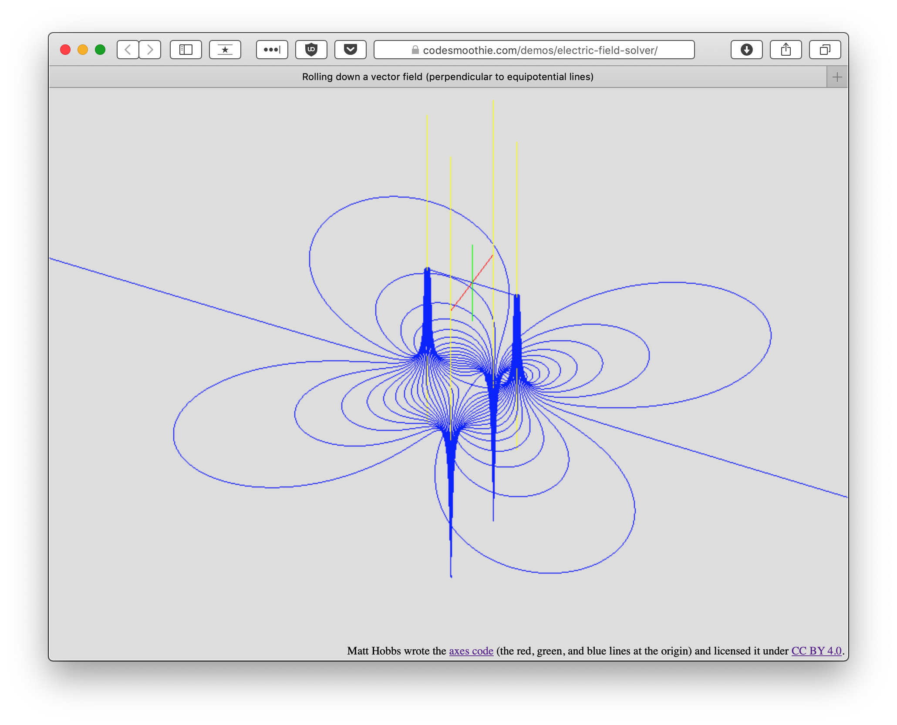

## How did I make this (needs to be rewritten; overly poetic)?

Suppose there is neither acceleration nor inertia in this universe: a ball rolls down a curved surface. At every point, the ball’s velocity is reset to zero and then redetermined by the slope of the surface. Given this ball and the slope of the surface at every ordered pair, I wish to map the contours of the surface. I want to find voltage, the height, given the electric field, the slope. 

0. I couldn’t control where the ball rolled unless I chose its starting position. Therefore, I couldn’t map the entire surface unless I carefully chose a very large number of starting points. Limiting my ambitions, I decided to only trace lines starting from the tallest places, which are near the positive point charges.

1. I had to sample the electric field at a very high resolution, because the direction the ball travels depends on its position and in this way, error accumulates rapidly. I took very small steps, millions for each line. Through experiments, I found that dividing by the square root of curvature provides a better step size, but I don’t know why. 

2. To improve performance, I rewrote the line computation code from JavaScript to C and compiled the C code to WebAssembly. 

3. Each field line (actually a curve) was approximated by drawing straight lines between the millions of steps the program took in space. But the browser froze when it tried to render all these tiny segments, and I wanted the user to be able to smoothly interact with the visualization. 

   In order to do that, I needed to use a few lines to approximate many lines. The program starts at the last plotted point and keep skipping points in the list until it exceeds a certain error threshold, at which it backs up and plots the last point it skipped. I created an error metric for this purpose: The list of skipped points forms a fan of triangles that all share the last plotted point. The error is equal to the area of this fan. 

   This curve simplification method retained visual resolution and reduced the number of plotted points 35,000 fold. (Because of time constraints, and the method appeared to work very well for my cases, I didn’t try to prove that my error metric would work for all cases.) 

4. The browser was still unresponsive while computing lines. I moved the computations off the main processing thread so user interactions and line computations could take place simultaneously. Lines were still computed one at a time, though.

5. Then, I tried processing all the lines simultaneously, each on their own thread, but it wasn’t optimal to spawn that many threads. So I wrote a little module that queued up all the required line computations, spawned only the number of threads as there are CPU cores, and assigned line computations to idle threads. 

6. I wanted more CPU cores to compute more lines at the same time. I considered leveraging the GPU, but general purpose GPU programming was too difficult. I then looked to cloud functions, which, for my purposes, were CPU cores on demand. I offloaded line computations from the browser onto Google’s servers, giving my users’ browsers permission to take an eternal sabbatical and improving line generation time by a few fold.

The result is an interactive 3D model of lines tracing the fall down a 2D electric field, generated live in a reasonable amount of time.

Next step would be to enable user configuration of the point charges, thread count, resolution, and other settings, which are currently hard-coded. 

## Credits

These are the code dependencies I directly added to my codebase. They don't 
include build tools or runtime code added by build tools.

 - [Three.js](https://threejs.org) for 3D drawing
 - [Three.js OrbitControls](https://github.com/mrdoob/three.js/blob/master/examples/js/controls/OrbitControls.js) for enabling user interaction on the 3D model
 - [glMatrix](http://glmatrix.net) for efficient representation and manipulation of vectors in JavaScript
 - [Axios](https://github.com/axios/axios) for making network requests
 - [Flyd](https://github.com/paldepind/flyd) for wiring things up functionally
 - Doug Gwyn's [floating point comparison code](http://c-faq.com/fp/fpequal.html) (adapted)

